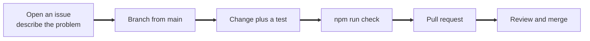

# Contributing to Porchlight

Thank you for helping. Porchlight is for people having the worst night of their year, so we value reliability and plain language over cleverness.

## Getting set up

```bash
npm install
cp .env.example .env
npm run check
```

`npm run check` runs everything CI runs: typecheck, tests, the firmware crypto cross-check, and the chaos simulation. If it is green on your machine, it will be green in CI.

## How we work



* **Every behaviour change comes with a test.** Protocol changes need a test in `packages/protocol/test`.
* **Anything that could lose an alert** needs a chaos run: `npm run sim nodes=50 loss=0.4 cycles=100 assert`.
* **Keep the protocol compatible.** A change to the frame or event format must bump the version and keep verifying old events.
* **Never commit secrets** (`.env`, `config.h`, node data folders) or CGI's challenge data.

## Writing style

The same rules apply to code comments, the interface and the docs:

* Plain words and short sentences. Write for a tired person reading on a phone in the dark.
* Sentence case for headings and buttons.
* Status is always given in words, never by colour alone.
* No double hyphens and no em dashes as punctuation. Use a comma, a colon, or a new sentence.
* Say what is simulated and what is real.

## Where things live

| You want to change | Look in |
| - | - |
| Event format, signing, sync, projection | `packages/protocol/src` |
| The node agent or its console | `apps/node/src`, `apps/node/public` |
| The city app, the 3D city, the API | `apps/city` |
| The beacon | `firmware/porchlight-beacon` |
| The chaos simulation | `apps/sim/src/run.ts` |

## Code of conduct

Everyone taking part is expected to follow our [Code of Conduct](CODE_OF_CONDUCT.md).
