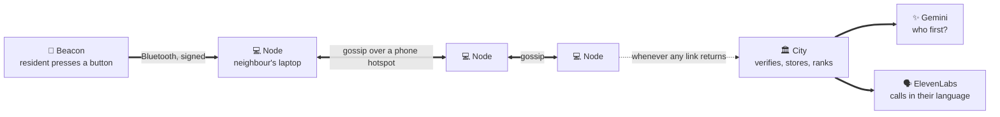
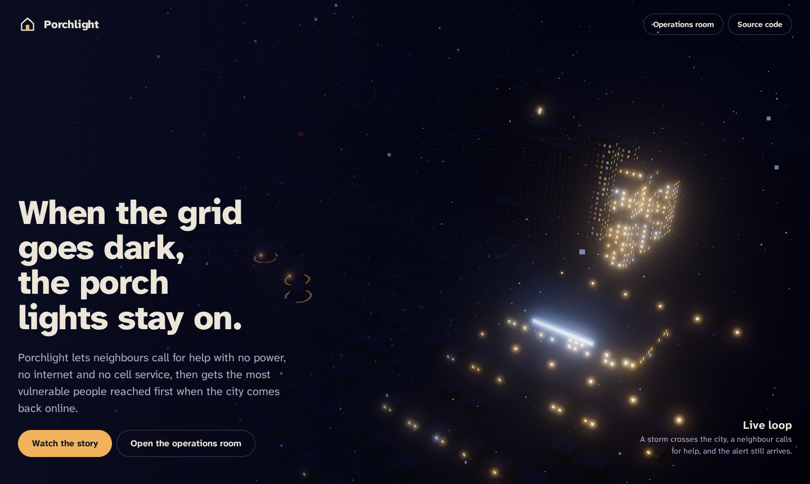
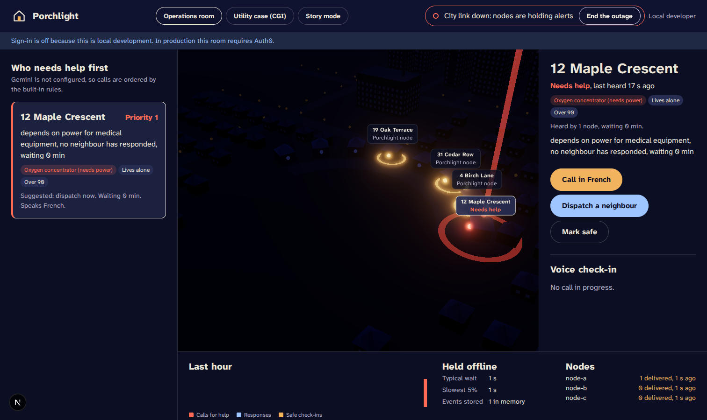
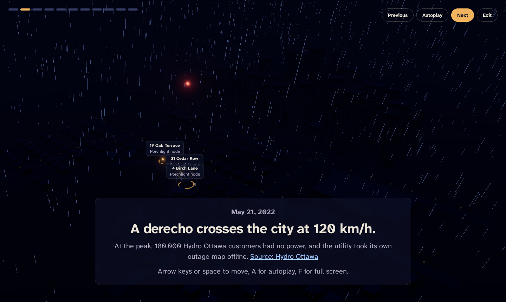
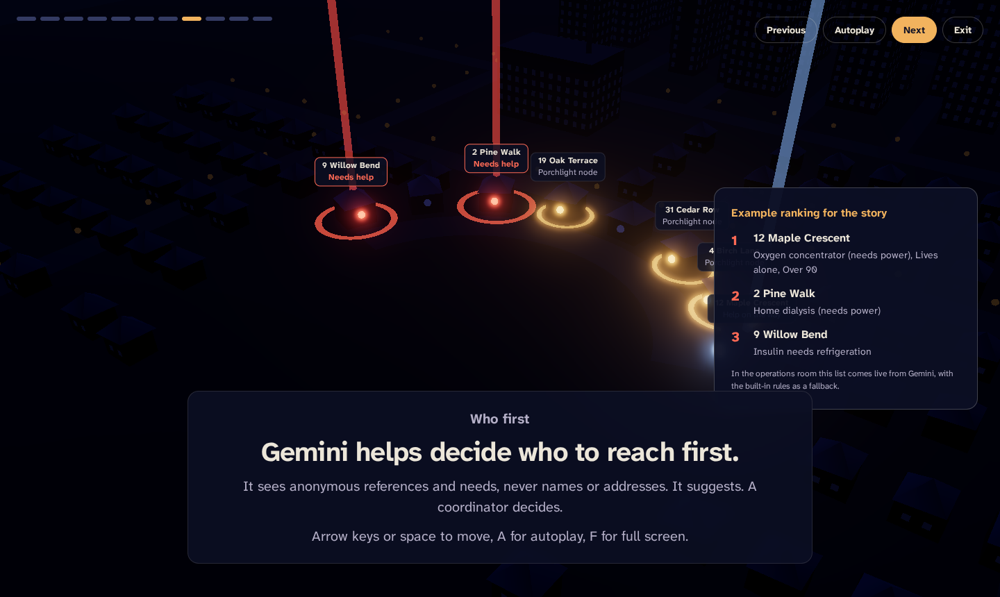
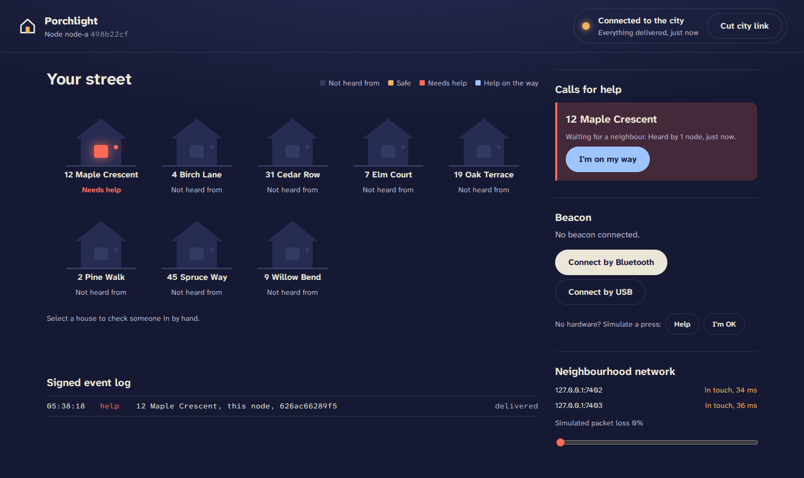
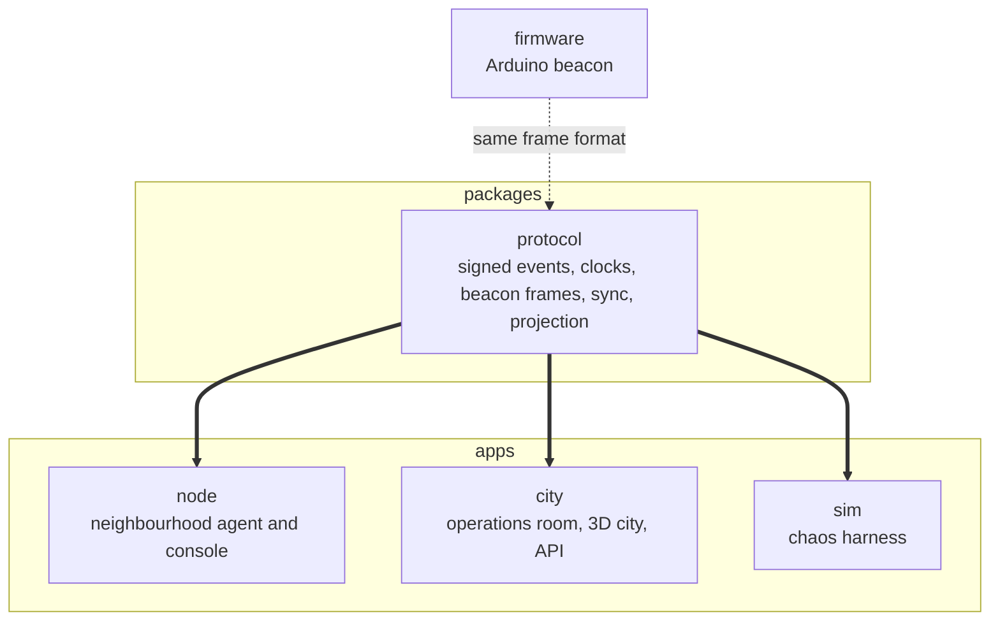

<div align="center">

# 🏠 Porchlight

### When the grid goes dark, the porch lights stay on.

**An offline-first emergency network for neighbourhoods.**
Residents call for help with a button. Neighbours' laptops relay the call with no internet and no cell service.
When any link to the city comes back, every call arrives, and the most vulnerable people are reached first.

[How it works](#how-it-works) · [Run it in five minutes](#run-it-in-five-minutes) · [Architecture](docs/ARCHITECTURE.md) · [Security](docs/SECURITY.md) · [Demo script](docs/DEMO.md)

</div>

## Why this exists

On **May 21, 2022**, a derecho crossed Ottawa with winds around 120 km/h. At the peak, about **180,000 Hydro Ottawa customers** had no power, more than half of the utility's customers, and Hydro Ottawa temporarily took its own outage map offline ([source](https://hydroottawa.com/en/about-us/regulatory-affairs/major-events/May-21-2022)). Cell towers ran down their batteries. Eight days later, about 10,000 customers were still in the dark.

The people who needed help most were the people least able to ask for it: someone alone on oxygen, a family with a newborn, a neighbour with dialysis at home. Every emergency tool they had depended on the thing that had just failed.

Porchlight is built for that night.

## How it works



1. **A resident presses a beacon.** A small Arduino signs the alert with its own key and sends it over Bluetooth. No app, no account, no signal.
2. **Neighbours pass it on.** Laptops in nearby homes verify the alert, store it, and gossip it to each other. Lost messages are repaired on the next exchange. A neighbour can tap "I'm on my way", and the beacon turns green.
3. **The city reaches the right door first.** When any node reconnects, the city verifies every alert again, stores it in Tiger Data, ranks who needs help first with Gemini, and calls residents in English or French with an ElevenLabs voice agent.
4. **Silence is a signal.** During an emergency, the operations room watches vulnerable homes that have gone quiet. Motion, presence and lights on from a beacon count as signs of life and clear the silent list; lights off does not. When a home that depends on power (oxygen concentrator, home dialysis, or insulin that needs refrigeration) reports lights out, the city shows a Power out tag, doubles that home's silent risk, and boosts triage. The people who need help most are often the ones who never call, so Porchlight flags them for a proactive check-in before anyone has to press a button.
5. **Hey Porchlight.** The coordinator can talk to the operations room. A voice copilot summarises the queue, flies the 3D map to a home, dispatches a neighbour, or starts a resident check-in, hands free, while every action stays on the signed event log.
6. **Porch Circles.** Each vulnerable home has two nearby buddies. A call reaches those buddies first, then the whole street, then the city, with signed neighbour replies that work even when the city link is cut. The city accepts those `reply` events end to end, shows the escalation tier and reply thread in the operations room, and ranks a home higher once no neighbour has answered.

## What we proved

| Claim | Evidence |
| - | - |
| Nothing gets lost | Chaos simulation: 30 nodes, 30% of all messages dropped, city link cut 50 times. **200 of 200 alerts delivered, 0 lost.** Run `npm run sim:ci` yourself. |
| Nobody can fake a call for help | Every event is signed with Ed25519 and every beacon frame carries a SipHash tag. Forged, replayed and flooded frames are rejected. See [PROTOCOL.md](docs/PROTOCOL.md). |
| The firmware and the node agree byte for byte | A host build of the firmware's crypto is cross-checked against the TypeScript implementation in CI. |
| The city never forgets | Events are written to Tiger Data before a node is told they arrived, and the city reloads them after a restart. |

> These are simulation and test results, not a field trial. We say so on every screen that shows them.

## The screens

| Screen | Who it is for | What you see |
| - | - | - |
| **Node console** (`localhost:7401`) | A neighbour hosting a node | Alerts nearby, who is safe, a button to say "I'm on my way", mesh health, a chaos slider |
| **Operations room** (`/ops`) | City coordinators, signed in with Auth0 | A 3D city at night, the ranked queue of who needs help first, live voice check-ins, a Tiger Data timeline |
| **Story mode** (`/present`) | Judges, councillors, anyone | An 11 chapter walkthrough of the derecho night. Arrow keys to move, A to autoplay, F for full screen |
| **Landing page** (`/`) | The public | The 3D city on a loop: a storm crosses, a call for help goes out, the lights come back |

## See it

| | |
| - | - |
|  |  |
| **Landing page.** The storm sweeps west to east, the way the 2022 derecho did. | **Operations room, city link down.** Every window is dark except the three node homes. The red beam is a call for help. |
|  |  |
| **Story mode.** The whole city dark, with the source on screen. | **Who first.** Power-dependent needs rise to the top. |
|  | |
| **Node console.** What a neighbour sees, with no internet. | |

*Screenshots are from a headless browser with software rendering; a real GPU looks sharper.*

## Run it in five minutes

You need **Node.js 22** or newer. Nothing else is required: every integration is optional and says clearly on screen when it is switched off.

```bash
npm install
cp .env.example .env

# Terminal 1: the city app on http://localhost:3000
npm run city:dev

# Terminal 2: three neighbourhood nodes that deliver to that city
CITY_URL=http://localhost:3000 npm run demo:local
```

On Windows PowerShell, set the variable first: `$env:CITY_URL="http://localhost:3000"; npm run demo:local`

Then:

1. Open **http://localhost:3000/ops**, the operations room.
2. Open **http://localhost:7401**, a node console, and press **Help** under "Simulate a press".
3. Watch the alert hop between houses in the 3D city and appear at the top of the queue.
4. Press **Simulate city outage**. The city goes dark and the nodes hold everything. Press a few more beacons, end the outage, and watch the backlog arrive.

### Everyday commands

| Command | What it does |
| - | - |
| `npm run check` | Everything CI runs: typecheck, tests, firmware crypto, chaos simulation |
| `npm test` | All unit tests. `npm test protocol` runs only matching files |
| `npm run sim nodes=50 loss=0.4 cycles=100` | A bigger chaos run. Add `assert` to fail on any loss |
| `npm run keygen pl-b02` | A new beacon id and key, printed for both `.env` and the firmware |
| `npm run voice:generate` | Records the offline voice clips with ElevenLabs |
| `npm run db:migrate` | Creates the Tiger Data schema |
| `npm run city:build` then `npm run city:start` | Production build of the city app |

## Repository map



```
porchlight/
├── packages/protocol/     Shared protocol, used by every other part
├── apps/node/             Node agent (runs on a neighbour's laptop) and its console
├── apps/city/             City app: operations room, story mode, API
├── apps/sim/              Chaos simulation used in CI
├── firmware/              Arduino Nano 33 BLE beacon and a host test of its crypto
├── config/                Fictional demo households and the city registry
├── deploy/                Caddy configuration for HTTPS
├── docs/                  Architecture, protocol, security, hardware, demo, deploy
└── docker-compose.yml     One command production stack for a single server
```

## Built with

| Part | Technology | Why |
| - | - | - |
| Beacon | Arduino Nano 33 BLE Sense, ArduinoBLE, SipHash | A button anyone can press, authenticated in 18 bytes |
| Mesh | TypeScript, Ed25519, hybrid logical clocks, anti-entropy gossip | Works on any laptop, survives loss and restarts |
| City | Next.js 16, React 19, three.js | One app for the operations room, the story and the API |
| Sign in | **Auth0** | Only coordinators see health information |
| Storage | **Tiger Data** (PostgreSQL with TimescaleDB) | Hypertables, compression and continuous aggregates for a time series of alerts |
| Triage | **Google Gemini** | Structured, schema checked ranking from anonymous references |
| Voice | **ElevenLabs** Agents and v3 text to speech | Two way check-ins in English and French, with auditable tools |
| Hosting | **Vultr**, Caddy, Docker | One small server with automatic HTTPS |
| Domain | **GoDaddy Registry** | A real address for the city |

Setup for each integration is in [DEPLOY.md](docs/DEPLOY.md).

## Documentation

| Document | Read it if you want to |
| - | - |
| [ARCHITECTURE.md](docs/ARCHITECTURE.md) | Understand how the pieces fit and what happens when each one fails |
| [PROTOCOL.md](docs/PROTOCOL.md) | Know every byte on the air and every field in an event |
| [SECURITY.md](docs/SECURITY.md) | See the threat model and how we map to the OWASP Top 10:2025 and the OWASP LLM Top 10 |
| [HARDWARE.md](docs/HARDWARE.md) | Flash the beacon and troubleshoot it |
| [DEMO.md](docs/DEMO.md) | Run the live demo, with a backup for every step |
| [DEPLOY.md](docs/DEPLOY.md) | Put the city online with Vultr, a domain, Auth0, Tiger Data, Gemini and ElevenLabs |
| [CONTRIBUTING.md](CONTRIBUTING.md) | Send a change |

## Honest limits

We would rather you hear these from us.

* **Range.** Bluetooth reaches roughly a house or two. Coverage needs nodes in many homes, which is a community problem as much as a technical one.
* **Power.** Nodes run on laptop batteries. A long outage needs a charging plan, such as a car charger or a power bank.
* **The registry.** The city's list of household needs is sensitive. In a real deployment it would come from an opt-in program run by the city, and it never leaves the city server. All data in this repository is fictional.
* **Field testing.** Everything here is proven in simulation and on a table of laptops, not yet on a real street.

## License

Porchlight is open source under the [Apache License 2.0](LICENSE). The Atkinson Hyperlegible fonts are under the SIL Open Font License, included next to the font files.

Built at **Hack the Hill III**, University of Ottawa, September 2026.
