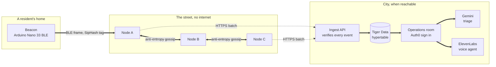
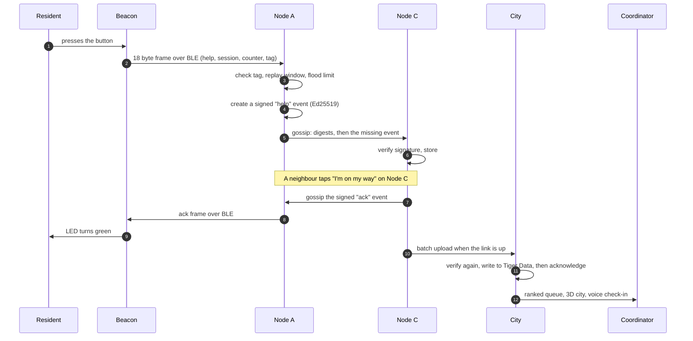
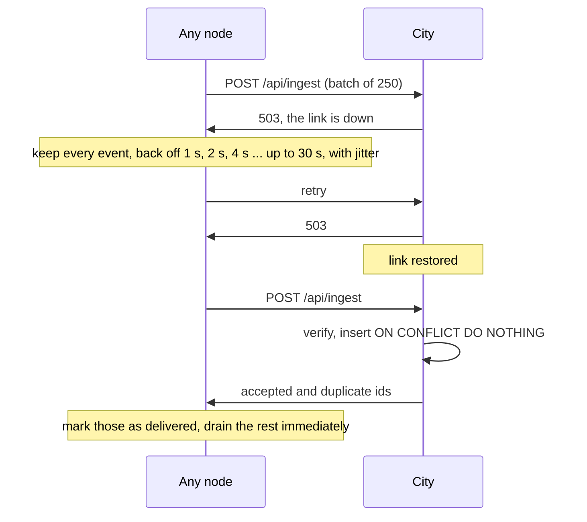
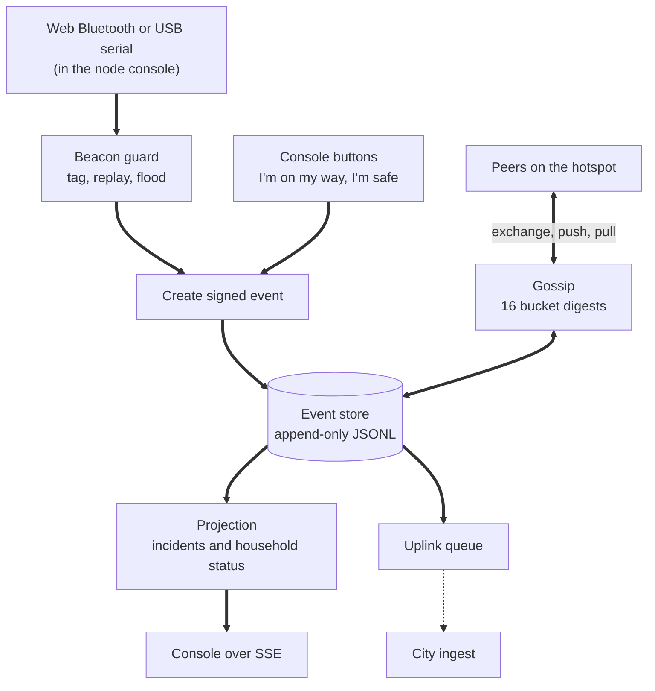
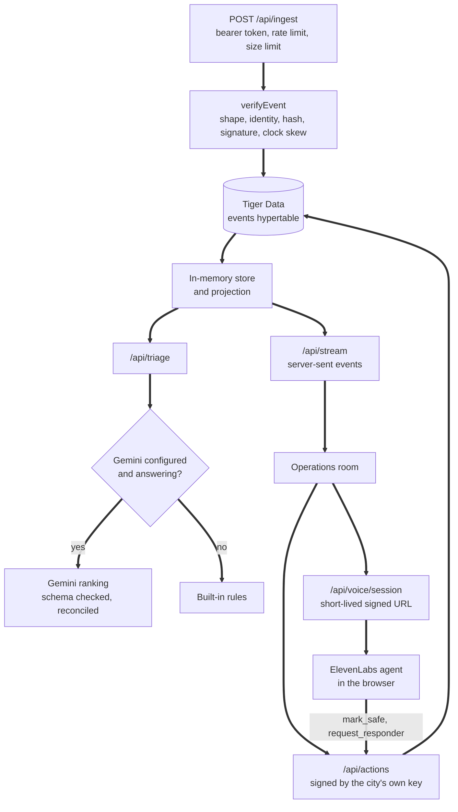
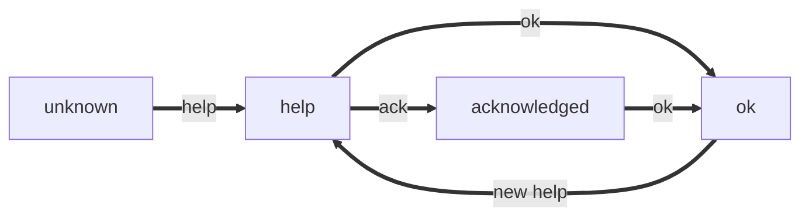

# Architecture

Porchlight has one rule that shapes everything else: **every part must keep working when the part next to it fails.** A beacon works without a node. A node works without the internet. The city works without Gemini, ElevenLabs or even its database. Each layer adds value when it is available and never becomes a dependency.

## The big picture

Dotted lines are links that are often down. Solid lines work locally.

## One call for help, end to end

Steps 1 to 10 need no internet at all. The city only enters at step 11, and it can arrive minutes or hours later without losing anything.

## When the city link goes down

A node only forgets that an event needs uploading after the city says it is stored. If the database write fails, the city answers 503 and the node simply tries again. Duplicates are harmless because the event id is the hash of its contents.

## Inside a node

* **The event store is a grow-only set.** Events are never edited or deleted, only added. Two nodes that have seen the same events always compute the same state, whatever order the events arrived in.
* **Gossip is cheap when nothing changed.** Nodes first swap 16 short bucket hashes. Equal hashes mean identical contents, so most rounds end after one small message.
* **The log survives crashes.** A half-written last line after a power cut is ignored on restart instead of corrupting the store.

## Inside the city

* **Write first, then acknowledge.** An event is in Tiger Data before the node is told it arrived.
* **The city signs its own actions.** When a coordinator or the voice agent marks someone safe, that becomes an Ed25519 signed event from the city's identity, stored like any other. Every change is attributable.
* **The city acts like another neighbour for its own decisions.** Each ingest reply includes recent city-signed events. Nodes verify them, keep them, and gossip them onward, so a dispatch or mark-safe made in the operations room clears the same call on every node console.
* **Silence is a signal.** When a coordinator declares an emergency, the city watches vulnerable homes (those with recorded needs) that send no event for a configurable stretch of time. The people who need help most are often the ones who never call, so the operations room can check in or send someone before a beacon is pressed.
* **Porch Circles in the city.** The city reads the same `BUDDY_WINDOW_SEC` and `STREET_WINDOW_SEC` as the nodes. For every open incident it computes the escalation tier, lists the registered buddies, and builds the neighbour reply thread. Triage scores a "city" tier higher (+15) than "street" (+5) or "buddies", and the operations room shows chips, the Neighbours panel, trust-trail labels, and amber buddy arcs in the 3D view while a call is still in the buddies window. Signed `reply` events are accepted at ingest; Tiger Data's kind check includes `reply`.
* **Analytics come from TimescaleDB.** The last hour timeline reads a continuous aggregate (`events_per_minute`) with real-time blending. On plain PostgreSQL the same numbers are computed on the fly.

## The data model

Everything is an event. There are seven kinds.

| Kind | Meaning | Created by |
| - | - | - |
| `help` | Someone needs help. Carries an incident key from the beacon | A node, when a beacon frame is valid |
| `ok` | This household is safe. Resolves any open incident there | A node (long press or console), or the city |
| `ack` | Someone is on the way. Points at the `help` event it answers | A node console, or the city |
| `note` | Free text about a household, 280 characters at most | A node console |
| `reply` | A neighbour's Porch Circles quick reply (`omw`, `cant`, `generator`, `blocked`) | A node on the street |
| `notice` | Bilingual city broadcast (`en`, `fr`, severity) | The city only |
| `alive` | Sign of life (reserved; no extra payload yet) | A node or the city |

State is a **projection**: a pure function from the set of events to incidents and household statuses. There is no mutable state to fall out of sync.

## What happens when things fail

| Failure | What the resident sees | What the system does |
| - | - | - |
| No node in Bluetooth range | Red fast blink | The beacon repeats the alert every 3 seconds for 10 minutes, so a node that comes into range later still hears it |
| A node crashes | Nothing | Its neighbours already have its events. On restart it reloads its log and catches up by gossip |
| 30% of messages are lost | Nothing | The next gossip round repairs the gap. Measured: 0 of 200 alerts lost |
| The city is unreachable | Nothing | Nodes hold everything and retry with backoff. Neighbours can still respond locally |
| The database is down | Nothing | Ingest answers 503 and nodes retry. The operations room shows "Database unavailable" |
| Gemini is slow or down | Nothing | After 12 seconds the city ranks with the built-in rules and says so on screen |
| ElevenLabs is down | Nothing | The operations room speaks the opening line with the browser voice instead |
| Auth0 is not configured in production | Nothing | The operations room stays closed. It never falls back to open |

## Design decisions

**Why gossip instead of a mesh routing protocol?** Routing needs the network to hold still long enough to learn it. During a storm it does not. Gossip needs no routes: every node eventually holds every event, and duplicates cost nothing.

**Why a grow-only set of signed events?** Because it makes merging trivial and forgery impossible. Any node can relay any event without being trusted, since every reader checks the signature for itself.

**Why hybrid logical clocks?** Laptops that have been offline for hours disagree about the time. A hybrid logical clock stays close to wall time but never goes backwards, so "who asked first" still has an answer.

**Why SipHash on the beacon instead of Ed25519?** An Arduino can sign with Ed25519, but it is slow and the frame gets large. SipHash gives a strong 8 byte tag with a shared key per beacon, and the node converts the alert into a fully signed event immediately.

**Why is AI advisory only?** Because a model that is wrong about who is in danger must never be able to act on its own. Gemini orders the queue; a person dispatches. The voice agent can only use two narrow tools, and each use is shown in the transcript and stored as a signed event.
