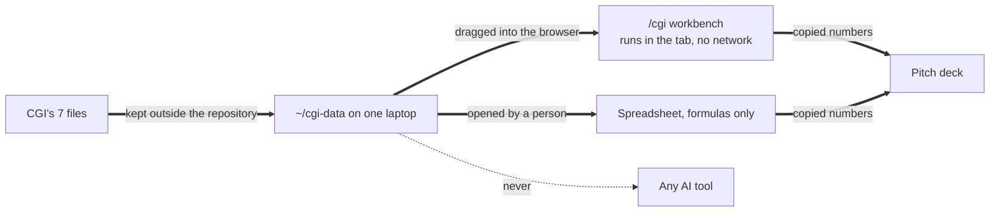

# The CGI challenge, without AI touching the data

> **The rule:** none of CGI's challenge data may go into an AI tool. Doing so disqualifies the team.
> This includes chat assistants, coding assistants such as Cursor or Copilot, AI spreadsheet features, and this repository's own Gemini and ElevenLabs integrations.

We treat that rule as an engineering requirement, not a promise.

## How we keep the data away from AI



1. **Keep the files outside this repository**, for example in `~/cgi-data`. Coding assistants index whatever is inside the project folder.
2. **Never paste their contents** into a chat, an issue, a commit message or a prompt. Summaries you write yourself are fine; copied rows are not.
3. **Use the workbench at `/cgi`.** It reads the file in your browser tab and sends nothing anywhere.
4. **Let the build enforce it.** `apps/city/test/ai-firewall.test.ts` fails if any file in the CGI module imports an AI SDK, calls the network, or references an AI route.
5. **Belt and braces.** `.cursorignore` and `.gitignore` exclude `cgi-data/` and `*.cgi.csv` in case a file ever lands in the wrong place.

Turn off AI features in your spreadsheet app (for example Copilot in Excel or "Help me organize" in Google Sheets) while the CGI files are open.

## The brief, and our reframe

CGI's client, a utility, says complaint handling is too slow and wants AI to automate triage and responses, clear the backlog, and lift its regulator score above 4.0 within 12 months. CGI adds that deciding **whether it is the right brief** is part of the job.

| The brief as written | The question we test with the data |
| - | - |
| Automate complaint triage and response with AI | How many of these complaints exist only because customers were not told what was happening, and can we stop them before they are filed? |

Faster handling of a complaint that should never have existed is still a cost. The cheapest complaint is the one that is never filed.

Porchlight is the same idea in an emergency: tell people what is happening, in their language, before they have to ask.

## How to find the insight (by hand)

CGI says the key insight spans more than one file. A method that respects the rule:

1. **Read every file's columns yourself.** Write one line per file describing what it contains.
2. **Count complaint categories** in the workbench (step 2). Tick every category that would not exist if the customer had been told what was happening: outages without updates, estimated bills, no reply.
3. **Look for the cause in the other files.** For example, do estimated meter reads, low smart meter coverage, or staffing gaps line up in time with spikes in those categories? Do it with filters and pivot tables you build yourself.
4. **Check the 2025 AI pilot honestly.** Did it make handling faster while the number of complaints stayed the same? That is the evidence that the brief is aimed at the wrong end.
5. **Write the insight in one sentence** before you build anything.

## The value case

The workbench turns four measured inputs and three stated assumptions into low, base and high cases.

```
complaints avoided per year = complaints per year × preventable share × deflection rate
gross savings per year      = complaints avoided × cost to handle one complaint
net savings per year        = gross savings − yearly running cost
payback                     = implementation cost ÷ net savings per year
net present value           = discounted net savings over the horizon − implementation cost
```

| Input | Where it comes from |
| - | - |
| Complaints per year | The complaint file, using the date column. The workbench annualizes it |
| Preventable share | The categories you ticked, measured by the workbench |
| Cost per complaint | CGI's unit cost file |
| Implementation and running costs | Your own estimate. Show how you got it |
| Deflection rate (low, base, high) | An assumption. Say where it comes from, for example the share of complaints filed during outages with no update |

The workbench refuses impossible inputs, shows every formula under the table, and copies the whole case with its assumptions as a table for your slides. If the numbers say it does not pay back, it says so. **That honesty scores better than an inflated number.**

## Mapping to CGI's judging (100 points)

| Criterion | Points | What we show |
| - | - | - |
| Problem framing | 20 | The reframe above, backed by a number we measured |
| Solution and feasibility | 20 | Proactive notification using data the utility already has |
| Build | 25 | The workbench and the Porchlight city app, running live |
| Value case | 20 | Low, base and high cases with every assumption visible |
| Pitch | 15 | Ten minutes, one story, and an answer ready for the curveball |

## What not to claim

* Do not quote a number you did not compute from their files.
* Do not say AI analyzed their data. It did not, and that is the point.
* Do not promise the regulator score. Explain which complaints stop existing, and let the score follow.
