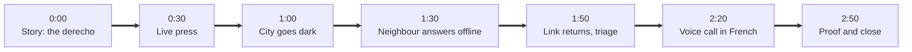

# Demo script

Three minutes, live, with a backup for every step. Rehearse it twice with a timer.

## Who does what

| Person | Laptop | Screen |
| - | - | - |
| Presenter | City laptop, on the projector | Story mode, then the operations room |
| Resident | Holds the beacon | Nothing. Sits "at home" |
| Neighbour | Node A laptop | Node console at `localhost:7401` |
| Backup | Node B laptop | Node console, plus the recorded video, ready to play |

## The script

**0:00 Story mode, chapters 1 to 3.** "May 21, 2022. 180,000 homes in Ottawa lost power, and the utility took its own outage map offline. These three homes still glow. They run Porchlight."

**0:30 The live press.** Switch to the operations room. The resident presses the beacon. On Node A the alert appears and the beacon's LED turns amber. On the projector, 12 Maple Crescent lights up with a red beam and goes to the top of the queue: "oxygen concentrator, lives alone, over 90".

**1:00 The city goes dark.** Click **Simulate city outage**. The storm sweeps across the 3D city and every window goes out except the three node homes. "The internet is gone. Watch what still works."

**1:30 The neighbour answers, offline.** On Node A, click **I'm on my way**. The beacon turns green in the resident's hand. "No internet, no cell service. The acknowledgement is signed, so nobody can fake reassurance."

**1:50 The link returns.** Click **End the outage**. Alerts fly from the node homes to City Hall. The queue ranks everyone: "Gemini only sees anonymous references and needs. It suggests; a coordinator decides."

**2:20 The voice call.** Select 12 Maple Crescent and click **Call in French**. A teammate answers in French and says she is fine. The agent uses its `mark_safe` tool, the transcript shows it, and her house turns amber.

**2:50 Proof and close.** Story mode, last two chapters. "We dropped a third of all messages and cut the city 50 times. Zero of 200 alerts lost. When the grid goes dark, the porch lights stay on."

## If something breaks

| What breaks | Say this | Do this |
| - | - | - |
| The beacon will not connect | "Let me press it from the console" | Node A: **Help** under "Simulate a press". Keep `DEV_SIMULATE_BEACON=true` on Node B only, as the backup |
| Bluetooth is flaky | Nothing | **Connect by USB** in the node console |
| The venue Wi-Fi dies | "Good, that is the point" | Everything runs on one phone hotspot. Or on one laptop: `npm run city:dev` and `npm run demo:local` |
| The voice agent fails | "The fallback speaks the same line" | The operations room falls back to text to speech, then the browser voice, automatically |
| Gemini is slow | Nothing | The queue says "ranked by the built-in rules" within 12 seconds |
| The projector struggles with 3D | "Let me show you on this screen" | Story mode on the laptop screen. Or play the recorded video |
| Everything fails | "Here is the run we recorded this morning" | Play the video |

## Checklist, the hour before

* [ ] All laptops charged and plugged in. Display sleep off. Notifications off.
* [ ] One phone hotspot. Every node's `PEERS` points at the others' hotspot addresses.
* [ ] New beacon key generated with `npm run keygen pl-b01` and flashed. The demo key is gone from `.env`.
* [ ] `DEV_SIMULATE_BEACON=false` on Node A, `true` on Node B.
* [ ] `npm run voice:generate` done, so node consoles speak even offline.
* [ ] Chrome or Edge on every node laptop, microphone permission granted on the city laptop.
* [ ] Operations room signed in with Auth0, and 12 Maple Crescent reset: press **Mark safe** after the rehearsal.
* [ ] `npm run check` green. The recorded video on the backup laptop's desktop.

## Questions judges will ask

**"Why not just use a mesh app on phones?"** Phones die first, and many of the people most at risk do not use smartphones. A button needs no literacy, no language and no screen.

**"What stops a prank?"** Every beacon has its own key, every frame is authenticated, replays and floods are rejected, and every event names the node that created it. See [SECURITY.md](SECURITY.md).

**"How far does it reach?"** A house or two per hop over Bluetooth. Laptops relay over a hotspot or local Wi-Fi. Coverage grows with every home that hosts a node.

**"Isn't the health registry a privacy risk?"** Yes, which is why it never leaves the city server, nodes never see it, and Gemini sees only anonymous references.

**"What did you learn?"** Answer with your own story. One from the build: when we cut a single node's link to the city, its neighbour carried the alert there instead. We had not designed for that explicitly; it fell out of gossip, and the chaos harness is how we proved it holds at scale.
