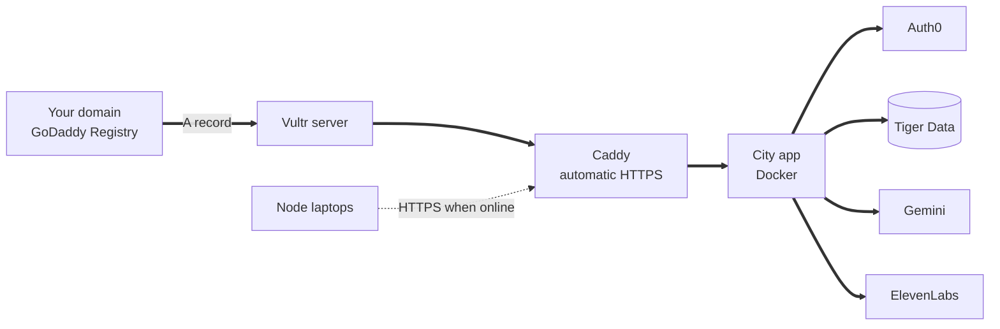

# Deploy

This guide puts the city app on the internet at your own domain, then switches on each integration. Every step is optional except the server and the domain: whatever you skip, the app keeps working and says what is off.



## 1. Get a domain

Claim the free domain offered through MLH with GoDaddy Registry (the link is on the Hack the Hill Devpost page and at the MLH table). Pick something short that says what it does.

Leave the DNS settings open in a tab. You need the server's address from the next step.

## 2. Create the server on Vultr

1. In the Vultr console, deploy a **Cloud Compute** instance with **Ubuntu 24.04**, at least **2 GB of memory**, in **Toronto**.
2. Add your SSH key, then note the public IPv4 address.
3. At your domain's DNS settings, add an **A record** for `@` pointing at that address, and another for `www`.

Log in and install Docker:

```bash
ssh root@YOUR_SERVER_IP
curl -fsSL https://get.docker.com | sh
ufw allow OpenSSH && ufw allow 80 && ufw allow 443 && ufw enable
```

The build needs more memory than a small server has, so add swap once:

```bash
fallocate -l 2G /swapfile && chmod 600 /swapfile && mkswap /swapfile && swapon /swapfile
echo '/swapfile none swap sw 0 0' >> /etc/fstab
```

## 3. Start Porchlight

```bash
git clone https://github.com/YOUR_ACCOUNT/porchlight.git
cd porchlight
cp .env.example .env
nano .env
```

Set at least these values:

| Variable | Value |
| - | - |
| `DOMAIN` | Your domain, without https |
| `ACME_EMAIL` | Your email, for certificate notices |
| `CITY_INGEST_TOKEN` | Output of `openssl rand -hex 32`. The same value goes on every node |
| `REPO_URL` | Your public repository address |

Then:

```bash
docker compose up -d
docker compose logs -f city
```

Open `https://YOUR_DOMAIN`. Caddy fetches the certificate on the first visit, which can take a minute. `https://YOUR_DOMAIN/api/health` shows which integrations are on.

To update later: `git pull && docker compose up -d` rebuilds and restarts.

## 4. Auth0: who may open the operations room

1. In the Auth0 dashboard, create an application of type **Regular Web Application**.
2. In its settings, set:

| Setting | Value |
| - | - |
| Allowed Callback URLs | `https://YOUR_DOMAIN/auth/callback, http://localhost:3000/auth/callback` |
| Allowed Logout URLs | `https://YOUR_DOMAIN, http://localhost:3000` |
| Allowed Web Origins | `https://YOUR_DOMAIN, http://localhost:3000` |

3. Copy the domain, client id and client secret into `AUTH0_DOMAIN`, `AUTH0_CLIENT_ID` and `AUTH0_CLIENT_SECRET`.
4. Set `AUTH0_SECRET` to the output of `openssl rand -hex 32`.
5. Put the team's emails in `COORDINATOR_EMAILS`, comma separated.
6. Optional but recommended: turn on multi-factor authentication under **Security**.

Without these values, the operations room is open in local development and **closed** in production.

## 5. Tiger Data: durable storage and analytics

1. In the Tiger Cloud console, create a service. The free tier is enough.
2. Copy its connection string into `DATABASE_URL`.
3. From your laptop, with the same `.env`, run:

```bash
npm run db:migrate
```

The migration creates a hypertable for events, turns on compression for history older than a week, and builds a continuous aggregate called `events_per_minute` that feeds the timeline in the operations room. It is safe to run again. On plain PostgreSQL it skips the TimescaleDB features and says so.

## 6. Gemini: who first

1. Create an API key in [Google AI Studio](https://aistudio.google.com).
2. Set `GEMINI_API_KEY`. `GEMINI_MODEL` defaults to `gemini-3.6-flash`, with `gemini-2.5-flash` as the automatic backup.

The queue header changes from "ranked by the built-in rules" to "Ranked by Gemini" once it works.

## 7. ElevenLabs: voices and the check-in agent

### Voices

1. Create an API key in ElevenLabs and set `ELEVENLABS_API_KEY`.
2. Pick an English and a French voice in the voice library and set `ELEVENLABS_VOICE_ID_EN` and `ELEVENLABS_VOICE_ID_FR`.
3. Record the offline clips that nodes play with no internet:

```bash
npm run voice:generate
```

This uses Eleven v3 with expressive tags such as `[calm]`, and falls back to Multilingual v2 if your plan does not include v3.

### The check-in agent

Create an agent in **ElevenLabs Agents**, starting from a blank agent, and configure it like this. Names in the dashboard can shift slightly between releases; the ideas stay the same.

**System prompt:**

```
You are Porchlight, calling on behalf of the city during a power outage.
You are calling {{household_label}}. Speak {{language}}.
What the city knows about this home: {{needs}}. They asked for help {{wait_minutes}} minutes ago.

Your only job is to find out whether they are safe right now.
Keep every turn short and calm. Never promise an arrival time. Never give medical advice.
If they say they are safe, call the tool mark_safe with a short note, then say goodbye.
If they need help, are unsure, or you cannot understand them, call request_responder with the reason.
If they describe a fire or trouble breathing, tell them to call 911 if any phone works, and call request_responder immediately.
```

**First message:** anything. The app overrides it with the right language for each household.

**Languages:** English by default, with French added.

**Client tools.** Add two tools of type *client*, and turn on waiting for a response:

| Tool | Parameter | Description to give the agent |
| - | - | - |
| `mark_safe` | `note` (string, optional) | Marks the household safe. Use only when the resident says they are safe |
| `request_responder` | `reason` (string) | Asks the city to send a neighbour or responder now |

**Security:** turn on authentication, so the agent can only be opened with a signed URL from our server. Allow **overrides** for the first message and the language.

Copy the agent id into `ELEVENLABS_AGENT_ID`. The server passes `household_label`, `language`, `needs`, `wait_minutes`, `household_id` and `incident_key` as dynamic variables on every call.

## 8. Point the nodes at the city

On each node laptop, in `.env`:

```bash
CITY_URL=https://YOUR_DOMAIN
CITY_INGEST_TOKEN=the same token as the server
```

Nodes deliver whenever they can reach it, and hold everything when they cannot.

## Running it all on one laptop

For rehearsals or a venue with no internet:

```bash
npm run city:build
npm run city:start
CITY_URL=http://localhost:3000 npm run demo:local
```

A production build keeps the operations room closed unless Auth0 is configured. For a quick local run without Auth0, use `npm run city:dev` instead.
