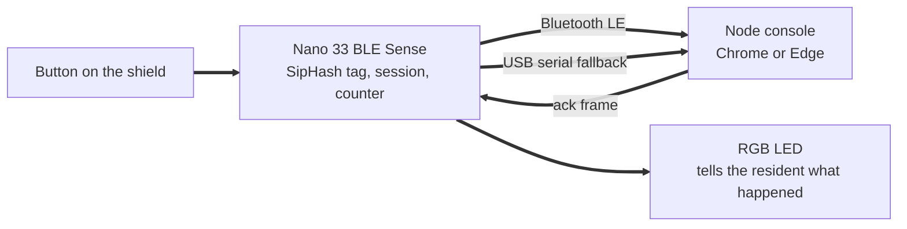

# Hardware: the Porchlight beacon

The beacon is one button a resident can press in the dark. It runs on the **Arduino Nano 33 BLE Sense** from the Tiny Machine Learning Kit, powered from a USB power bank or a laptop.



## What the light means

| Light | Meaning |
| - | - |
| Red, fast blink | Help was sent, but no node has picked it up yet. The beacon keeps trying every 3 seconds for 10 minutes |
| Amber, slow blink | A node received the call. Waiting for a neighbour |
| Green, solid | A neighbour is on the way. This comes from a signed acknowledgement, so it cannot be faked |
| Blue, short flash | "I'm safe" was sent |
| Purple, fast blink | Possible fall detected, press the button within 10 seconds to cancel |

**Press** the button for help. **Hold it for 1.5 seconds** to say "I'm safe".

## Fall detection

When fall detection is on (`FALL_DETECTION 1` in `config.h`), the on-board motion sensor watches for a short free fall (magnitude below 0.45 g for at least 80 ms), then an impact, then a moment of stillness. A hard knock alone, such as setting the beacon on a desk, does not start the sequence. If that free-fall sequence looks like a fall, the LED blinks purple for 10 seconds. Press the button in that window to cancel. If you do not cancel, the beacon sends a fall frame (the same path as a help press, including resends until a neighbour acknowledges).

You can exercise the countdown without dropping the board by typing `PLX` in the Serial Monitor.

## Signs of life

When the matching flags are on in `config.h`, the beacon also reports quiet signals that a home is occupied and that lights changed. These are fire-and-forget frames: sent twice, one second apart, with no acknowledgement and no LED change.

| Signal | Frame kind | How it is decided |
| - | - | - |
| Moved | 5 `moved` | Acceleration differs from 1 g by more than 0.15 g for at least three samples since the last report |
| Lights | 6 `lights_on` / 7 `lights_off` | Ambient clear channel from the APDS9960 crosses `LIGHT_DARK` / `LIGHT_BRIGHT` and stays there for 5 seconds. Unavailable readings are ignored and do not reset that timer |
| Presence | 8 `presence` | Every `PRESENCE_EVERY_SEC`, when idle, one grayscale frame is reduced to an 8 by 8 grid of block averages relative to that frame's mean, then compared with the previous grid; at least 6 percent of blocks changed by more than 12 levels. Frames darker than `CAMERA_TOO_DARK` are skipped. Presence is suppressed for `CAMERA_PRESENCE_SUPPRESS_MS` after a lights transition |

**Privacy promise.** The camera image never leaves the chip. No pixels are printed, stored for upload, or sent over Bluetooth. Only a yes or no (a `presence` frame) goes to the node.

**Honest limits.** The camera needs some light in the room; below `CAMERA_TOO_DARK` mean grayscale it reports too dark to judge and sends no presence. A whole-room brightness change (lights out or a covered lens) used to look like motion; block averages are now compared relative to each frame's mean, and presence is suppressed for 10 seconds after lights on or off. The light sensor means the room got brighter or darker, not that the grid is powered. Demo intervals are short (`ALIVE_EVERY_SEC` 20, `PRESENCE_EVERY_SEC` 10); a real deployment would use minutes.

Fall detection and an unacknowledged help alert always win: presence capture does not run during a fall countdown or while help is waiting for an ack.

Calibration commands in the Serial Monitor:

| Command | Does |
| - | - |
| `PLL` | Waits up to 300 ms for a fresh ambient reading, then prints `PLI light <n>`, or `PLI light no reading yet` if none arrives |
| `PLP` | Runs one presence check now and prints `PLI presence yes`, `PLI presence no`, or `PLI presence too dark to judge` (never pixel data) |
| `PLC` | Prints `PLI camera ready` or `PLI camera failed` |

On our board, PLL read about 4 in a lit room, about 116 with a phone flashlight, and 0 with a hand covering the sensor. Defaults are `LIGHT_DARK 1` and `LIGHT_BRIGHT 3`. Re-check with PLL in the room where you demo, since lighting varies.

Libraries for signs of life: **Arduino_LSM9DS1** (motion), **Arduino_APDS9960** (light), **ArduinoBLE** (already required), and **TinyMLShield** (camera, same start path as the kit's person_detection example).

## Set up the Arduino IDE (once per laptop)

1. Install the [Arduino IDE 2](https://www.arduino.cc/en/software).
2. Open **Boards Manager**, search for **Arduino Mbed OS Nano Boards**, and install it.
3. Open **Library Manager**, search for **ArduinoBLE**, and install it.
4. Plug the Nano in with the USB cable from the kit. Choose **Arduino Nano 33 BLE** as the board and pick its port.

## Give the beacon its own key

Every beacon needs a secret key that matches the nodes. From the repository root:

```bash
npm run keygen pl-b01
```

This prints two things:

* A `BEACON_KEYS=...` line. Put it in `.env` on **every** node laptop.
* A `#define BEACON_ID` and `BEACON_KEY` block. Copy `firmware/porchlight-beacon/config.example.h` to `config.h` and paste the block in.

`config.h` is ignored by Git so the key is never committed. The example file contains the public demo key `000102...0f`. **Replace it before judging.**

## Flash it

Open `firmware/porchlight-beacon/porchlight-beacon.ino` in the Arduino IDE and press **Upload**. Then open the **Serial Monitor** at **115200 baud**. You should see:

```
PLI Porchlight beacon pl-b01 session 1A2B3C4D
PLI button pin reads released
```

## The button: check this first

The shield's button shares pin D13 with the Nano's small orange LED. The firmware uses **shield mode** by default. It drives the pin high and senses presses through the input buffer, the same technique as Arduino's own TinyMLShield library. A side effect is that the small orange LED stays on. That is expected.

| What you see | What to do |
| - | - |
| Serial says `released`, and pressing sends help | You are done |
| Serial says `pressed` without you touching it | Set `BUTTON_SHIELD_MODE 0` in `config.h` and use a separate button (next row) |
| Compile error mentioning `nrf_gpio` | Set `BUTTON_SHIELD_MODE 0` in `config.h` |
| You want a big button instead | Wire a push button between pin D2 and GND, set `BUTTON_PIN 2` and `BUTTON_SHIELD_MODE 0` |

You can always test without the button by typing into the Serial Monitor:

| Command | Does |
| - | - |
| `PLH` | Sends help, as if the button were pressed |
| `PLO` | Sends "I'm safe" |
| `PLT` | Sends a test frame |
| `PLX` | Starts the fall countdown (bench test, no drop needed) |
| `PLL` | Waits up to 300 ms for light, then prints the level or "no reading yet" |
| `PLP` | Runs one presence check and prints yes, no, or too dark to judge |
| `PLC` | Prints whether the camera started |

## Connect it to a node

1. Start a node (`npm run node` or `npm run demo:local`) and open its console in **Chrome or Edge**. Web Bluetooth does not work in Firefox or Safari.
2. Click **Connect by Bluetooth** and choose `PL pl-b01`.
3. Press the button. The alert appears in the console and the LED turns amber.
4. Click **I'm on my way** on the alert. The LED turns green.

If Bluetooth will not cooperate, choose **Connect by USB** instead. The console then uses Web Serial with the same frames.

## Troubleshooting

| Problem | Fix |
| - | - |
| The beacon does not appear in the Bluetooth picker | Unplug and replug it. Make sure the Serial Monitor printed the startup lines. On macOS, allow Chrome to use Bluetooth in System Settings, Privacy and Security |
| "bad MAC" in the node console | The key in `config.h` does not match `BEACON_KEYS` in that node's `.env` |
| "unknown beacon (no key configured)" | That node's `.env` has no `BEACON_KEYS` entry for this beacon id |
| Every press after a restart says "replay" | The beacon lost its session and reused an old one. Reset it once. The firmware picks a random session at every boot |
| The LED stays red | No node is connected. Connect one, and the beacon's next repeat is delivered |
| Web Serial is missing | Use Chrome or Edge on desktop, and close the Arduino Serial Monitor first, because only one program can hold the port |

## Why these choices

* **SipHash, not a signature, on the air.** An 8 byte tag keeps each frame at 18 bytes and is fast on the microcontroller. The node turns a valid frame into a fully Ed25519-signed event straight away.
* **Resend until acknowledged.** A beacon pressed while no node is in range still gets through when one arrives.
* **A random session at boot, a counter per press.** Together they let nodes reject replays without the beacon needing a clock.
