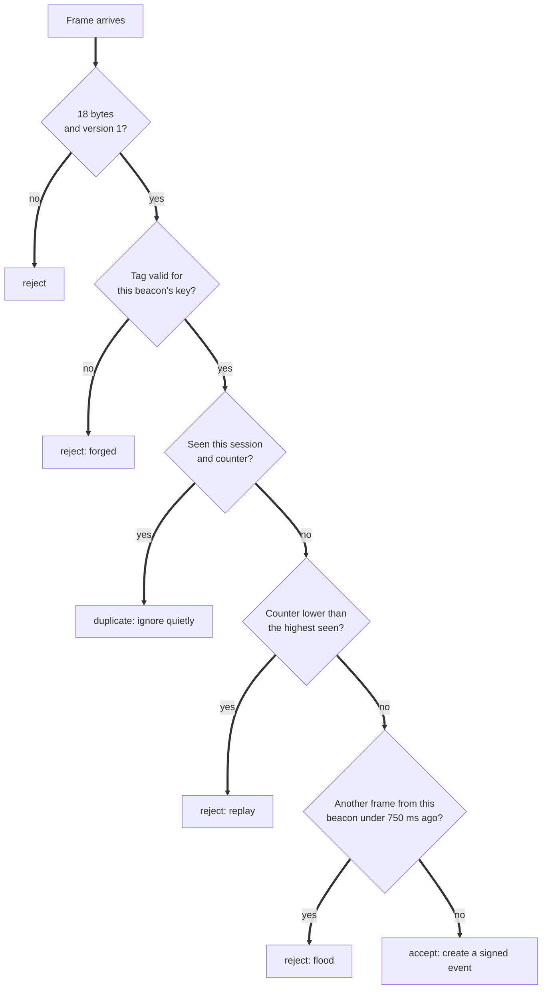
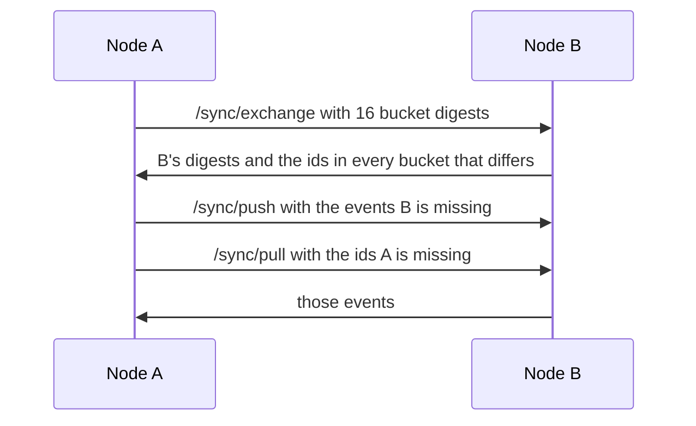

# Protocol

This is the complete wire format: what a beacon sends over the air, what a signed event looks like, how nodes gossip, and how the city accepts deliveries. The reference implementation is [`packages/protocol`](../packages/protocol/src), and the firmware copy lives in [`firmware/porchlight-beacon`](../firmware/porchlight-beacon).

## 1. The beacon frame

Every button press becomes one **18 byte frame**. The same format carries acknowledgements back to the beacon.

| Bytes | Field | Meaning |
| - | - | - |
| 0 | version | Always `1` |
| 1 | kind | `1` help, `2` ok (I'm safe), `3` test, `4` fall, `16` ack |
| 2 to 5 | session | Random 32 bit number chosen when the beacon boots, little endian |
| 6 to 9 | counter | Counts presses within a session, little endian, starts at 1 |
| 10 to 17 | tag | SipHash 2 4 of the message below, with the beacon's 16 byte key |

The tag covers the beacon id as well as the frame, so a frame cannot be replayed under another beacon's name:

```
tag = SipHash24(key, beaconId || 0x00 || bytes 0 to 9)
```

Example, from the shared test vectors (beacon `pl-b01`, key `000102...0f`, help, session `0x12340001`, counter 7):

```
01 01 34120000 07000000 5bcd4dfa2985ca76
```

The firmware's host test and the TypeScript tests both check this exact frame, so the two implementations cannot drift apart.

### What a node does with a frame



The replay window is rebuilt from the event log when a node restarts, so restarting a node never reopens old frames.

### Incident keys

A help frame opens an incident whose key is `beaconId:session:counter`, for example `pl-b01:12340001:7`. The beacon resends an unacknowledged help frame every 3 seconds for up to 10 minutes. All repeats share the same key, so they collapse into one incident, and every node that hears one is recorded as a **witness**.

### Getting frames into a node

| Transport | Details |
| - | - |
| Bluetooth LE | Service `7a1f0001-5c3e-4f6b-9d2a-6c1e0b8f4a10`. Alert characteristic `...0002` (read, notify). Ack characteristic `...0003` (write). Beacon id characteristic `...0004` (read). The node console connects with Web Bluetooth in Chrome or Edge |
| USB serial, 115200 baud | Beacon to node: `PLF1 <beaconId> <36 hex characters>`. Node to beacon: `PLA1 <36 hex characters>`. Also accepts `PLH`, `PLO` and `PLT` to simulate a press |

## 2. The signed event

Nodes and the city speak only in signed events. An event is JSON:

```json
{
  "v": 1,
  "kind": "help",
  "household": "hh-maple-12",
  "origin": "3f9a0c21b7d4e815",
  "pub": "q2Jm4xk0uZ8c2m3G8H1d6vS8rj6d1o4e0n7Yp9a2BcE",
  "hlc": "001790000000000.000000.3f9a0c21b7d4e815",
  "incident": "pl-b01:12340001:7",
  "source": { "type": "beacon", "beacon": "pl-b01", "rssi": -61 },
  "lang": "fr",
  "id": "6a3eeb50968677196c8b7562536c3961b86473873f534b33e1c395317d35cde2",
  "sig": "(86 base64url characters)"
}
```

| Field | Rule |
| - | - |
| `v` | Protocol version, always `1` |
| `kind` | `help`, `ok`, `ack` or `note` |
| `household` | Lowercase slug from the household roster |
| `origin` | The creating node's id: the first 16 hex characters of SHA 256 of its public key |
| `pub` | The creating node's Ed25519 public key, base64url |
| `hlc` | Hybrid logical clock: wall time in milliseconds, a logical counter, and the node id |
| `incident` | Required for `help` |
| `ref` | For `ack`: the id of the `help` event being answered |
| `source` | `beacon`, `console` or `sim`, with the beacon id and signal strength when known |
| `note` | Printable text only, 280 characters at most, no control characters |
| `id` | SHA 256 of the canonical JSON of every field above |
| `sig` | Ed25519 signature over the same canonical JSON |

**Canonical JSON** means keys sorted, no whitespace, and the same bytes on every machine. The id is a content hash, so the same event can never arrive twice under different ids.

### Verifying an event

Every node and the city verify every event from anyone, in this order:

1. The shape matches the schema exactly. Unknown fields are rejected.
2. `origin` really is derived from `pub`.
3. `id` really is the hash of the body.
4. `sig` is a valid Ed25519 signature by `pub`.
5. The clock is not more than 15 minutes in the future.
6. Optionally, `origin` is in the configured roster of allowed nodes.

A relaying node never needs to be trusted. It can only pass on events that someone could have verified themselves.

## 3. Gossip between nodes

Nodes reconcile with **anti-entropy**. Each round, a node picks up to two peers and runs this exchange:



Events are sorted into 16 buckets by the first hex character of their id. Each bucket's digest is a hash of its sorted ids, so two nodes with the same events have the same digests and the round ends after the first message. Batches are capped at 250 events and 20,000 ids.

When `NETWORK_KEY` is set, every gossip request carries an `x-porchlight-mac` header: HMAC SHA 256 of the body with the shared key. Requests without a valid MAC are refused. This keeps strangers on the same hotspot from filling a node with junk, even though they could not forge events anyway.

## 4. Delivering to the city

```
POST /api/ingest
Authorization: Bearer <CITY_INGEST_TOKEN>
Content-Type: application/json

{ "node": { "id": "3f9a0c21b7d4e815", "name": "node-a" }, "events": [ ...up to 250 signed events ] }
```

| Response | Meaning | What the node does |
| - | - | - |
| `200` with `accepted`, `duplicates`, `rejected`, `cityEvents` | Stored durably; `cityEvents` are city-signed decisions from the last 24 hours (at most 200, oldest first) | Marks accepted and duplicate ids as delivered; verifies each city event, adds it to the local store, marks it delivered so it is never uploaded back, then gossips it to neighbours |
| `401` | Wrong token | Keeps everything and retries later |
| `413` | Batch over 1 MB | Sends a smaller batch |
| `429` | Too many requests | Backs off |
| `503` | City link or database down | Keeps everything, backs off up to 30 seconds with jitter |

The city writes to the database before it answers, and inserts with `ON CONFLICT DO NOTHING`, so retries are always safe. City-signed actions (dispatch, mark safe, voice escalations) ride back down in `cityEvents`, so the street sees the same decisions the operations room made.

## 5. Projection rules

The state of the street is computed from the event set, never stored separately:

* A `help` opens an incident, or adds a witness to an existing one with the same key.
* An `ack` whose `ref` is the incident's first help event moves it from open to acknowledged.
* An `ok` resolves every earlier open incident at that household and marks the household safe.
* A household's status is the status of its latest event: unknown, help, acknowledged or ok.

Because the projection is a pure function of a set, every node that holds the same events shows exactly the same street.
