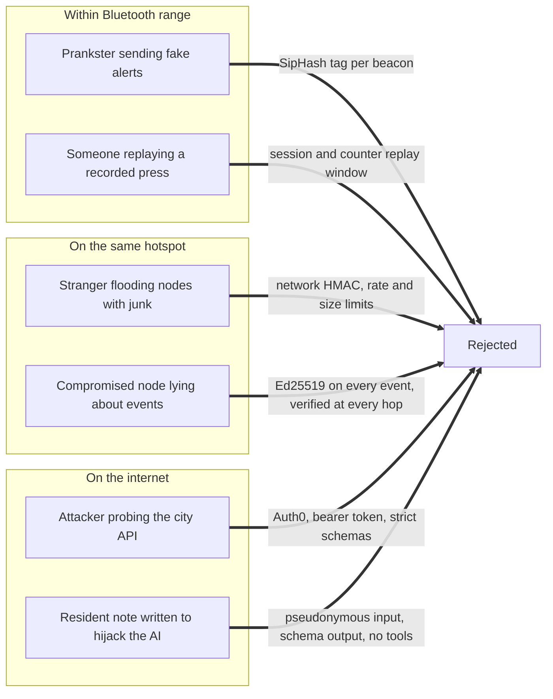
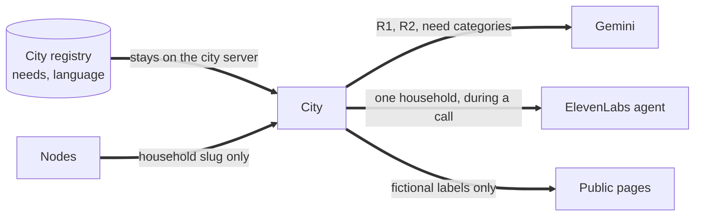

# Security

Porchlight carries calls for help and health information about vulnerable people. A bug here does not leak a password; it sends help to the wrong door, or tells a stranger who lives alone on oxygen. This document is how we think about that.

To report a vulnerability, see [SECURITY.md](../SECURITY.md) at the repository root.

## What we protect

| Asset | Why it matters |
| - | - |
| The truth of a call for help | A fake alert wastes a responder. A suppressed one can cost a life |
| The household registry (needs, language) | Knowing who is alone and dependent on power is dangerous in the wrong hands |
| Coordinator actions | "Marked safe" closes a case. It must be attributable and impossible to forge |
| CGI's challenge data | Their rule: it must never reach an AI tool |

## Who we defend against

**Out of scope, stated plainly:** an attacker who steals a beacon can press it (that is what it is for), and an attacker who steals a node's private key can create events as that node until it is removed from the roster. Bluetooth frames are authenticated but not encrypted, so a listener nearby can tell that a beacon was pressed. Frames contain no names or addresses.

## OWASP Top 10:2025

| Risk | How Porchlight handles it |
| - | - |
| **A01 Broken Access Control** | Every city API route checks the coordinator session on the server, not in the page. An optional email allow list (`COORDINATOR_EMAILS`) narrows who may sign in. The node console listens on loopback only, requires a per-start session token, and rejects cross-origin requests. The city makes no requests to URLs supplied by users, so there is no path to SSRF. |
| **A02 Security Misconfiguration** | Strict headers on every response: Content Security Policy, HSTS, `X-Frame-Options: DENY`, `nosniff`, a same-origin opener policy, and a Permissions Policy that allows only the microphone, only for this site. The framework banner is off. Without Auth0 in production the operations room **fails closed** rather than open. |
| **A03 Software Supply Chain Failures** | Every dependency is pinned to an exact version and installed from the lockfile with `npm ci`. CI runs `npm audit` and fails on high or critical findings. Dependabot proposes updates weekly. Fonts are self-hosted and no script is loaded from a third-party CDN. |
| **A04 Cryptographic Failures** | Ed25519 signatures and SHA 256 content ids from Node's built-in crypto. SipHash 2 4 with a 128 bit key per beacon. HMAC SHA 256 between nodes. Every secret comparison is constant time. HTTPS everywhere through Caddy, with HSTS. Session cookies are encrypted by the Auth0 SDK. Keys live in `.env` and `config.h`, both ignored by Git. |
| **A05 Injection** | All SQL is parameterized. Every input is parsed by a strict schema that rejects unknown fields. React escapes everything it renders, and the node console builds its page with `textContent` only. Notes may not contain control characters. |
| **A06 Insecure Design** | A threat model (this page). Write before acknowledge, so data is never lost on a crash. AI is advisory and cannot act alone. Health needs stay on the city server and are never sent to nodes. Rate limits on every expensive or sensitive route. |
| **A07 Authentication Failures** | Coordinators sign in with Auth0, where multi-factor authentication can be required. Sessions roll, expire after 2 hours idle and 12 hours in total, and can be ended with Sign out. Nodes authenticate to the city with a bearer token compared in constant time. |
| **A08 Software or Data Integrity Failures** | Every event is signed and content addressed, and verified again at every hop and at the city. The firmware's crypto is checked against shared test vectors in CI. Production images are built from the lockfile. |
| **A09 Security Logging and Alerting Failures** | Every delivery is recorded per node with accepted, duplicate and rejected counts. Every coordinator and voice agent action becomes a signed, stored event, which makes a tamper-evident audit trail. Storage, AI and voice failures are logged. Caddy writes structured access logs. *Gap:* there is no pager or alerting integration yet. |
| **A10 Mishandling of Exceptional Conditions** | Every external call has a timeout (Gemini 12 s, uplink 5 s, database connect 8 s) and a defined fallback. Errors return a short reason, never a stack trace. A database failure answers 503 so nodes retry instead of losing data. A torn last line in a node's log is skipped, not fatal. |

## OWASP Top 10 for LLM Applications (2025)

| Risk | How Porchlight handles it |
| - | - |
| **LLM01 Prompt Injection** | Resident notes are the only free text a model sees. They are stripped of control characters, cut to 200 characters, and the system instruction says to treat them as information, never as instructions. The output must match a JSON schema, and Gemini has no tools to misuse. |
| **LLM02 Sensitive Information Disclosure** | Gemini receives pseudonymous references (`R1`, `R2`), need categories and wait times. No names, addresses or household ids. CGI's data never reaches any model. The voice agent does receive the address and needs of the one household it is calling, because it cannot do its job without them. |
| **LLM03 Supply Chain** | Official Google and ElevenLabs SDKs, pinned. The model name is configuration (`GEMINI_MODEL`), not code. |
| **LLM04 Data and Model Poisoning** | We do not train or fine-tune models, and nothing users write is fed back into training. |
| **LLM05 Improper Output Handling** | Model output is parsed with a schema, invented references are dropped, duplicates removed, and any case the model skipped is added back by the built-in rules. It is rendered as plain text and never executed. |
| **LLM06 Excessive Agency** | Gemini can only reorder a list. The voice agent can use exactly two tools, `mark_safe` and `request_responder`. Both go through the same coordinator-only API as a human, each use appears in the call transcript, and each becomes a signed event. Dispatch is always a human decision. |
| **LLM07 System Prompt Leakage** | Prompts contain no secrets. Keys stay on the server, and the browser only ever receives a short-lived signed URL for the voice agent. |
| **LLM08 Vector and Embedding Weaknesses** | Not applicable. Porchlight uses no retrieval or vector store. |
| **LLM09 Misinformation** | The queue says "Suggestions only: you decide", shows a one sentence reason for every rank, and says clearly when the built-in rules are used instead of Gemini. |
| **LLM10 Unbounded Consumption** | Rate limits on triage and voice routes, a 60 second cache for identical triage requests, a 12 second timeout, request size limits, and cached text to speech. |

## Privacy by design

* Nodes know household slugs and fictional street labels, never needs.
* Public pages (landing, story mode) show no needs at all.
* The data in this repository is invented. A real registry would come from an opt-in program and be loaded with `CITY_REGISTRY_FILE`.

## CGI's data

CGI's rule is that none of their data may go into an AI tool. We treat that as a hard requirement:

* The CGI workbench reads files in the browser tab and sends nothing anywhere.
* `test/ai-firewall.test.ts` fails the build if anything in the CGI module imports an AI SDK, calls the network, or references an AI route.
* `.cursorignore` and `.gitignore` exclude CGI data patterns, and the team keeps the files outside this repository so no coding assistant can index them.

See [CGI.md](CGI.md) for the full procedure.

## Known gaps

We would rather list these than have a judge find them.

| Gap | Why it exists | What we would do next |
| - | - | - |
| The Content Security Policy allows inline scripts | Next.js injects its hydration data inline | Add per-request nonces in `proxy.ts` |
| Demo beacon key and ingest token ship in `.env.example` | So the demo runs in five minutes | `npm run keygen` and `openssl rand -hex 32` before any real use. The docs say so |
| Rate limits live in memory | One server is the target deployment | Move them to Redis or the database when running more than one instance |
| No revocation list for node keys | Rosters are configured by hand | Signed roster updates distributed by gossip |
| No alerting | Hackathon scope | Alert on repeated ingest rejections and on nodes going silent |

## Before a real deployment

1. Generate a new key for every beacon: `npm run keygen pl-b01`.
2. Set a long random `CITY_INGEST_TOKEN` and `NETWORK_KEY`.
3. Configure Auth0 and require multi-factor authentication for coordinators.
4. Set `COORDINATOR_EMAILS`.
5. Set `DEV_SIMULATE_BEACON=false` on every node.
6. Keep the real registry outside the repository and point `CITY_REGISTRY_FILE` at it.
